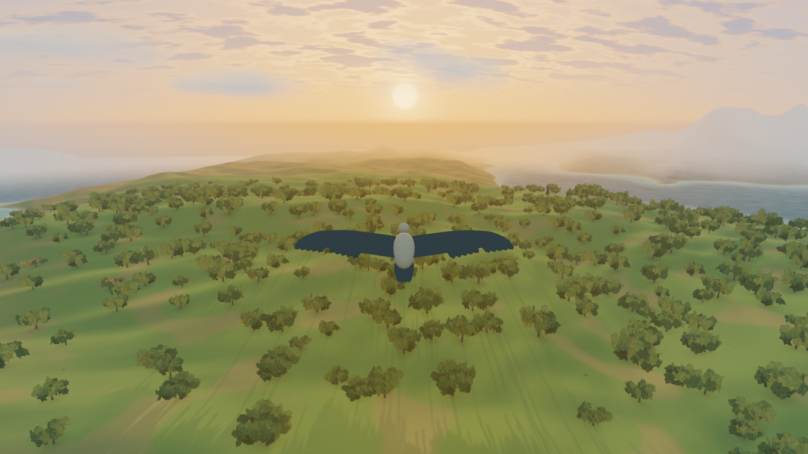

<h1 align="center">Fly With Me</h1>

  
  
  
  

  

<h3 align="center">A bird crossing an endless world, above and below the clouds.</h3>

A quiet page that asks nothing of you. <a href="https://kunchenguid.github.io/fly-with-me/">Open it and press Begin.</a>

Every world opens the same way: ten seconds before sunrise over oak hills, a turn into the sun as it clears the horizon, a climb through the clouds and back under them. Then the bird flies itself, across ten biomes that blend into one another and past the quiet ruins of an older world, through a ten-minute day and a dark night, turning of its own accord to meet the low sun, the moon and the core of the Milky Way. Drag to look around it, drag with the right button to steer it, or do nothing at all; the page remembers where you left off. There is no score, no goal and no end.

It is one page and nothing else. The world, the light and the sound are made in your browser from a seed, and the only thing fetched besides the page is Three.js.

## Using it

- The page opens on a white veil, then stands still behind one **Begin** button; nothing moves and no sound plays until you press it. Sound is synthesized in the browser, with an on/off switch and a volume slider that starts at half.
- Do nothing and the bird flies itself. Drag with the left button to orbit the bird, and the view stays where you leave it; drag with the right button to steer, up and down as well, and the bird flies where you look. The wheel zooms, touch steers, and the arrow keys nudge a turn or a climb that fades after a few seconds.
- **Pause**, or space with the canvas focused, stops the flight and the sound together. A reduced-motion preference starts the page paused.
- The page remembers your sound settings, your framing, and the bird's exact place, course and time of day, and resumes there after Begin. `?seed=<number>` in the address opens that world fresh; the share link carries the seed.
- WebGPU is used when available, over HTTPS or localhost; `?webgl=1` forces WebGL2, and the desktop corner names the backend.

## Read on

- [`VISION.md`](VISION.md): what the page is for, the experience it is meant to create, and what it welcomes and refuses.
- [`CONTRIBUTING.md`](CONTRIBUTING.md): how to run, check and publish it, and how to add a biome, a tree, a ruin or anything else to the world.
- [`AGENTS.md`](AGENTS.md): the engine's rules, for agents and anyone changing `src/`.
- [`docs/perf-notes.md`](docs/perf-notes.md): what a frame costs and what is left to win.

## License

[MIT](LICENSE) © Kun Chen. Three.js is loaded from a CDN and carries its own license.
